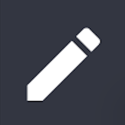

# UI Deep Dive

### Table of Contents

### Iconography
Initial Note: most icons going forward should have a small text description/title to make it more accessible and obvious. It won't detract from the UI but help to clarify features. We need to prepare not for the ideal user but the one that may click the "new" icon and remove all their work by accident. 

| New | Undo | Redo | Save | Upload | Bug Report |
| --- | ---- | ---- | ---- | ------ | ---------- |
|  |  |  |  |  |  |

#### New & Remove (new addition)
The purpose of this icon is to create a fresh, new page. It basically clears all work. I think that a clearing option can be useful to completely start over. However, there is no delete option on this website which is the most obvious feature users will use. A new page icon (like the one we're using) usually represents creating a new external doc or a new tab. This is currently our only "delete" method meaning users must start completely from scratch. Once this button has been clicked, it is a blank slate with no undo.

In the webapp, we had a giant trash can at the bottom of the screen. Users could either (a) drag a node towards the trash can, the lines around the screen would go red, and the node would disappear OR (b) they could double-click on the trash can to delete the whole whiteboard. The trash can is an icon everyone is familiar with. However, it was incorrectly labeled 'Delete' when it was actually a 'Remove' because, upon clicking the 'Undo' option, the node(s) reappeared in their previous position. Deletes are final (a destruction of data); removals are temporary (old data still accessible). While deletes are commonly associated with a trash can rather than removals, the visible trash can is so intuitive and obvious that users would be more likely to engage the feature. 

I think we can have both a clear and remove option. This can take the form of the following:
- (a) clear and remove are both icons at the top; both are trash cans with one having an 'x' for a more permanent deletion (aka clear)
- (b) users can back/right click on the whiteboard and choose clear
- (c) users can back/right click on a node and choose remove
- NOTE: we may want to have a notification of "Are you sure you want to clear" to confirm they understand that a clear removes ALL work
  - we can also log whether they're a new user or not so we only give them this warning the first time they use the site so it doesn't get annoying

- **References**: [Remove vs Delete](https://medium.com/swlh/ui-copy-remove-vs-delete-33c58ce16d9b)

---

#### Undo & Redo
Intuitive and follows the design of Google's undo/redo arrows. Follows a natural mapping of undo as left/the past and redo as right/future. The only change may be to make the undo arrow slightly darker than the redo to make it a bit more distinct and match the Google style.

- **References**: [Legacy of Undo/Redo](https://ux.stackexchange.com/questions/83723/why-are-the-undo-and-redo-arrow-icons-commonly-round)

#### Save & Upload
These are a little tricky. 'Save' is actually a **download** because it's moving from the remote server to a local drive. However, once the user clicks the upper tool bar 'Save' icon, the side bar pulls out and is labelled as 'Export'. Now, export is actually when we move from a local application to a remote drive. This is an issue because traditional download and export icons are VERY different: a download has a flat bar with an arrow pointing down; an export is when we have an arrow pointing out of a box. The directions of the arrows follow our learned mapping of downloading locally or exporting externally. Our 'save' icon has a box with an arrow pointing down. This is the icon for 'Import'. We need to be using a bar and arrow icon.

The 'Upload' is correct in that it's moving from a local drive to a remote server. The icon is correctly used (bar with arrow pointint up).

- **Suggestion**: Change sidebar wording to be 'Download' not 'Export' for 'save' and use the correct Download icon (bar with arrow).  
- **References**: [Download, Upload, Export, Import](https://graphicdesign.stackexchange.com/questions/119273/import-export-vs-upload-download-icons-arrow-direction)

#### Bug Report
The bug logo is explicit and does fit its name. It may be fine to keep it, however, users may also assume it is for "debugging" rather than filing a bug report/feedback. Sometimes feedback icons consist of a thumbs up and thumbs down together as that indicates an approval or disapproval. Many websites also use a circle with a question mark inside to indicate a section where more information/feedback can be given externally. We could also use a circle with an exclamation point as they usually have a negative connotation of "something is wrong" that would align more with the purpose of a bug report.

- **Notes**: after doing a bit more research, I [found our icon](https://material.io/resources/icons/?style=baseline) and it is in fact labeled a 'bug report' so we may not change it.

---

| Expand | Format | Test | Transform | Export |
| ------ | ------ | ---- | --------- | ------ | 
|  |  |  |  |  |

#### Export
This has the same icon as the 'Save' in the top/app bar. Both of these options pull out the sidebar and give options on how to download the work as different file types. This is NOT an export as we are not sharing but downloading the file locally. It is redundant to have 2 icons doing the same thing but labelled differently. This icon obviously goes against the traditional 'Export' icon (arrow pointing up, outside of box) as our arrow points inward. We need to remove one of these icons and make it represent the download one.

- **Suggestion**: Choose whether icon should live in top bar or side bar and use the correct Download icon (bar with arrow).  
- **References**: [Download, Upload, Export, Import](https://graphicdesign.stackexchange.com/questions/119273/import-export-vs-upload-download-icons-arrow-direction)

---

### Whiteboard
1. When right-clicking on the object, it should pull up the options to: 
- (a) make it an accept state (if not)
- (b) make it a non-accept state (if not)
- (c) delete that node
- (d) make it the initial state.
2. When clicking/hovering or doing any engagement with a node, it should change color slightly (lighter/darker) to indicate which node the user is interacting with and help them confirm their behavior
3. Arrows auto-conform to fit the distance/angle which is great
4. Nodes and arrows could be more distinct
5. For a large alphabet, the arrow gets filled with a lot of text that can fill up the space
  - text resizing should be an option (like a bar with +/- to change arrow text)
  - node text isn't a problem because it's typically only 2 characters (e.g. q2)
